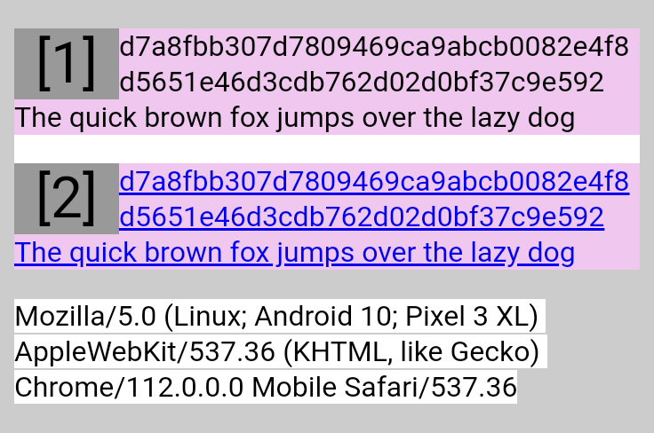
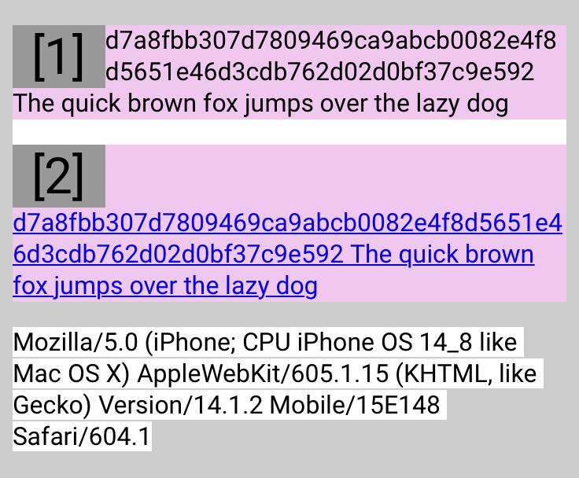
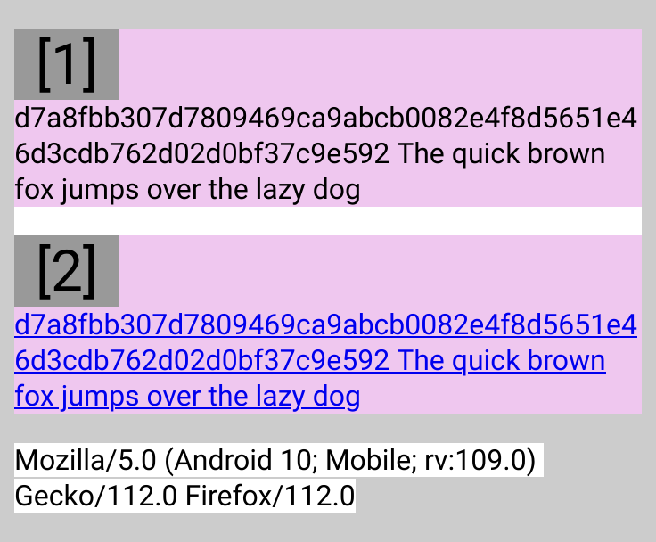
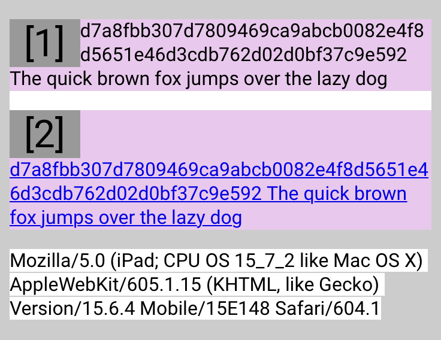

# Cross-browser differences with `word-wrap/overflow-wrap: break-word` around float (230415)

## Related links

- Static HTML: [230415-overflow-wrap-around-float.html](https://nooriro.github.io/hello/230415-overflow-wrap-around-float/230415-overflow-wrap-around-float.html) \([View in GitHub](230415-overflow-wrap-around-float.html)\)
- CodePen: <https://codepen.io/nooriro/full/QWZNqeQ>

## Different results in different browsers

Scroll left and right to see all the results.

<table>
  <thead>
    <tr>
      <th>Result in Chrome 112</th>
      <th>Result in Safari 14.1.2</th>
      <th>Result in Firefox 112</th>
    </tr>
  </thead>
  <tbody align="center" valign="top">
    <tr>
      <td></td>
      <td></td>
      <td></td>
    </tr>
  </tbody>
  <tfoot>
    <tr>
      <td>&emsp;&emsp;&emsp;&emsp;&emsp;&emsp;&emsp;&emsp;&emsp;&emsp;&emsp;&emsp;&emsp;&emsp;&emsp;&emsp;&emsp;&emsp;&emsp;&emsp;&emsp;&emsp;&emsp;&ensp;</td>
      <td>&emsp;&emsp;&emsp;&emsp;&emsp;&emsp;&emsp;&emsp;&emsp;&emsp;&emsp;&emsp;&emsp;&emsp;&emsp;&emsp;&emsp;&emsp;&emsp;&emsp;&emsp;&emsp;&emsp;&ensp;</td>
      <td>&emsp;&emsp;&emsp;&emsp;&emsp;&emsp;&emsp;&emsp;&emsp;&emsp;&emsp;&emsp;&emsp;&emsp;&emsp;&emsp;&emsp;&emsp;&emsp;&emsp;&emsp;&emsp;&emsp;&ensp;</td>
    </tr>
  </tfoot>
</table>

The results are all different from the others.

- **Chrome:** Both non-link and link text are wrapped around the floated box. This is the result that I expected.
- **Safari:** Only non-link text is wrapped around the floated box.
- **Firefox:** Neither non-link nor link text is wrapped around the floated box.

## Tested on

- Chrome 112, Firefox 112: **Android 10** `QQ3A.200805.001` on Google Pixel 3 XL
- Safari 14.1.2: **iOS 14.8** `18H17` on Apple iPhone 6s
- Safari 15.6.4: **iPadOS 15.7.2** `19H218` on Apple iPad Pro 10.5 (The result is the same as in Safari 14.1.2)

<table>
  <thead>
    <tr>
      <th>Result in Safari 15.6.4</th>
    </tr>
  </thead>
  <tbody align="center" valign="top">
    <tr>
      <td></td>
    </tr>
  </tbody>
  <tfoot>
    <tr>
      <td>&emsp;&emsp;&emsp;&emsp;&emsp;&emsp;&emsp;&emsp;&emsp;&emsp;&emsp;&emsp;&emsp;&emsp;&emsp;&emsp;&emsp;&emsp;&emsp;&emsp;&emsp;&emsp;&emsp;&ensp;</td>
    </tr>
  </tfoot>
</table>
