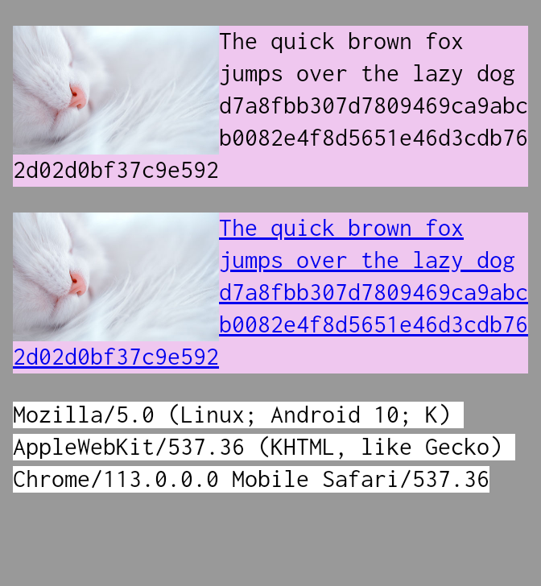
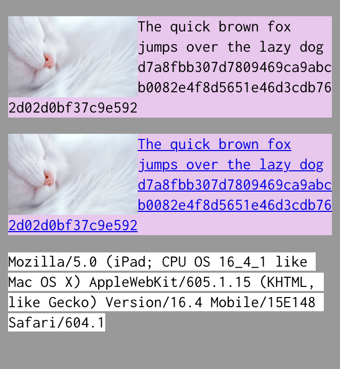
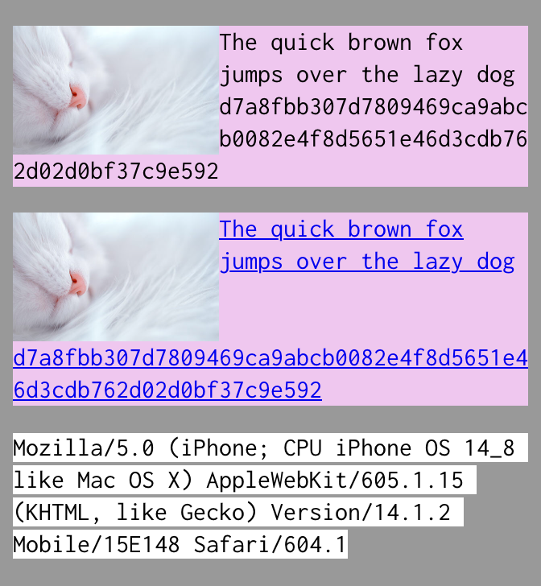
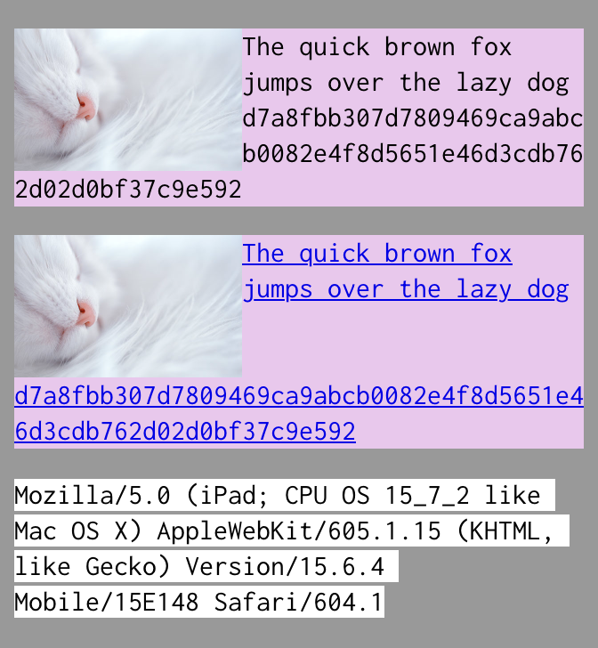

# Cross-browser differences with `word-wrap/overflow-wrap: break-word` around float

## Related links

- Static HTML: [230422-overflow-wrap-around-float.html](https://nooriro.github.io/hello/230422-overflow-wrap-around-float/230422-overflow-wrap-around-float.html) \([source on GitHub](230422-overflow-wrap-around-float.html)\)
- CodePen: <https://codepen.io/nooriro/full/xxygLyG> \([Editor View](https://codepen.io/nooriro/pen/xxygLyG), [Details View](https://codepen.io/nooriro/details/xxygLyG)\)

## Results in notable browsers

The followings are the results in the *latest* version of Chrome, Safari, and Firefox *as of May 17, 2023*.

Scroll left and right to see all the results.

| Result in Chrome 113 on Android | Result in Safari 16.4 on iPadOS | Result in Firefox 113 on Android |
|:-------------------------------:|:-------------------------------:|:--------------------------------:|
|  &emsp;&emsp;&emsp;&emsp;&emsp;&emsp;&emsp;&emsp;&emsp;&emsp;&emsp;&emsp;&emsp;&emsp;&emsp;&emsp;&emsp;&emsp;&emsp;&emsp;&emsp;&emsp; |  &emsp;&emsp;&emsp;&emsp;&emsp;&emsp;&emsp;&emsp;&emsp;&emsp;&emsp;&emsp;&emsp;&emsp;&emsp;&emsp;&emsp;&emsp;&emsp;&emsp;&emsp;&emsp; |  &emsp;&emsp;&emsp;&emsp;&emsp;&emsp;&emsp;&emsp;&emsp;&emsp;&emsp;&emsp;&emsp;&emsp;&emsp;&emsp;&emsp;&emsp;&emsp;&emsp;&emsp;&emsp; |

- A sleeping cat image \([source](https://pixabay.com/photos/cat-sleep-sleeping-cat-fluffy-6853848/)\) is **floated left.**
- A 64-hex-digit hash value `d7a8fbb307d7809469ca9abcb0082e4f8d5651e46d3cdb762d02d0bf37c9e592` is **too long to fit** within the element that contains it.
&emsp;\(&nbsp;Just an FYI: *It is the [SHA-256](https://en.wikipedia.org/wiki/SHA-256) hash value of* "`The quick brown fox jumps over the lazy dog`". \)

Setting `word-wrap` / `overflow-wrap` to `break-word` in CSS prevents the long hash value from overflowing out of the element. But the results are **different across browsers.** 

- **Chrome 113:** The long hash value is ***wrapped around the image*** *whether it’s non-linked or linked*.
- **Safari 16.4:** Same as Chrome 113.
- **Firefox 113:** The long hash value is ***dropped below the image*** *whether it’s non-linked or linked*.

Chrome 113 and Safari 16.4 are showing the expected result, but **Firefox 113 isn’t.**

## Old versions of Safari

Even Safari 15 (released on 2021-2022) shows the *inconsistent* result, which is different from the result in Safari 16.4.

- **Safari 15.6.4:** The long hash value is ***wrapped*** around the image ***if it’s non-linked***. It is ***dropped*** below the image ***if it’s linked***.
- **Safari 14.1.2:** Same as Safari 15.6.4.

| Result in Safari 14.1.2 on iOS | Result in Safari 15.6.4 on iPadOS | Result in Safari 16.4 on iPadOS |
|:------------------------------:|:---------------------------------:|:-------------------------------:|
|  &emsp;&emsp;&emsp;&emsp;&emsp;&emsp;&emsp;&emsp;&emsp;&emsp;&emsp;&emsp;&emsp;&emsp;&emsp;&emsp;&emsp;&emsp;&emsp;&emsp;&emsp;&emsp; |  &emsp;&emsp;&emsp;&emsp;&emsp;&emsp;&emsp;&emsp;&emsp;&emsp;&emsp;&emsp;&emsp;&emsp;&emsp;&emsp;&emsp;&emsp;&emsp;&emsp;&emsp;&emsp; |  &emsp;&emsp;&emsp;&emsp;&emsp;&emsp;&emsp;&emsp;&emsp;&emsp;&emsp;&emsp;&emsp;&emsp;&emsp;&emsp;&emsp;&emsp;&emsp;&emsp;&emsp;&emsp; |

Testing Safari on i(Pad)OS is a headache. First, Safari is tied to OS. You need N corresponding versions of iOS/iPadOS for testing N versions of Safari. Second, downgrading iOS/iPadOS is impossible except some special cases. Once the OS version is updated, the device will never be able to test the previous version of Safari.

## Tested on

- **Chrome 113, Firefox 113:** Android 10 `QQ3A.200805.001` on Google Pixel 3 XL
- **Safari 14.1.2:** iOS 14.8 `18H17` on Apple iPhone 6s
- **Safari 15.6.4:** iPadOS 15.7.2 `19H218` on Apple iPad Pro 10.5
- **Safari 16.4:** iPadOS 16.4.1 `20E252` on Apple iPad Pro 11 4th gen (Thanks: Apple Garosugil)
