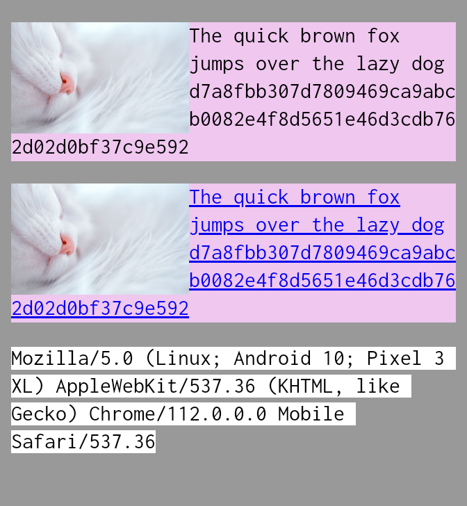
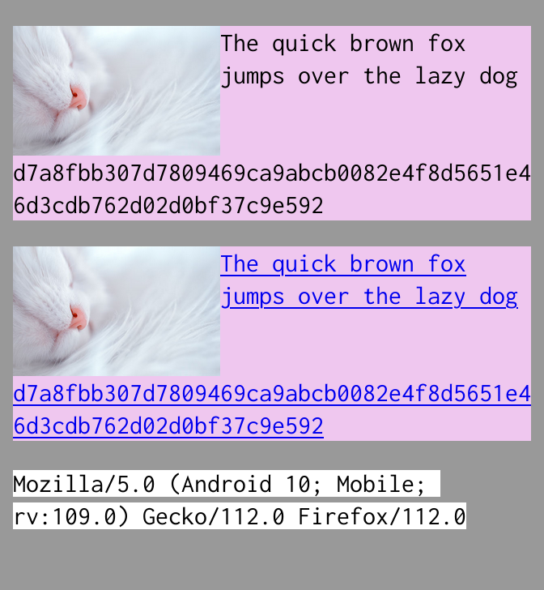
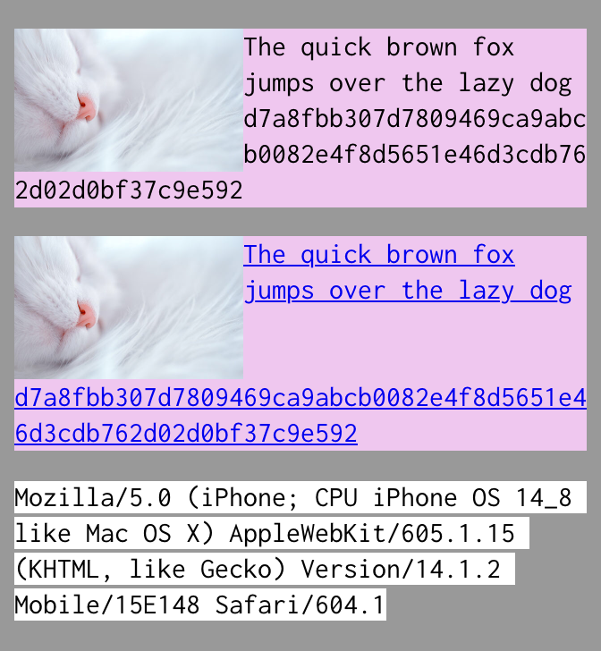
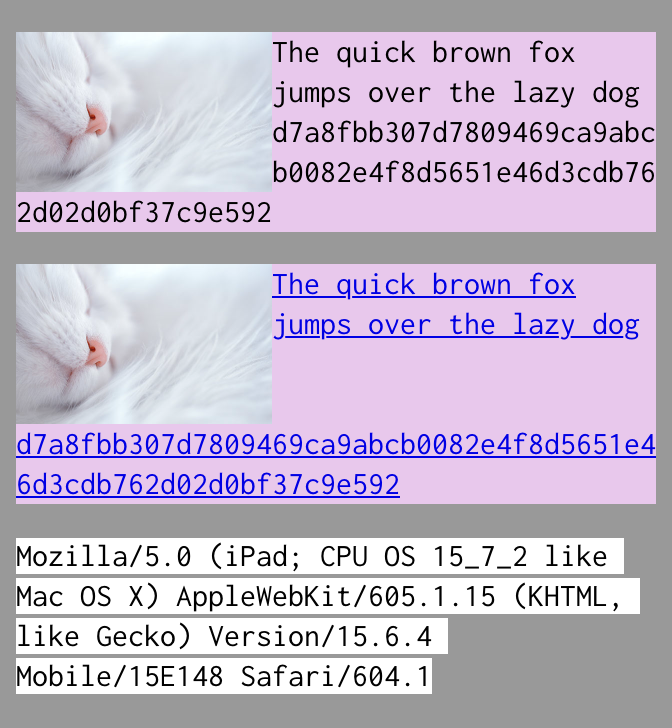

# Cross-browser differences with `word-wrap/overflow-wrap: break-word` around float (230422)

## Related links

- Static HTML: [230422-overflow-wrap-around-float.html](https://nooriro.github.io/hello/230422-overflow-wrap-around-float/230422-overflow-wrap-around-float.html) \([source on GitHub](230422-overflow-wrap-around-float.html)\)
- CodePen: <https://codepen.io/nooriro/full/xxygLyG> \([Editor View](https://codepen.io/nooriro/pen/xxygLyG), [Details View](https://codepen.io/nooriro/details/xxygLyG)\)

## Different results in different browsers

The results in Chrome, Firefox, and Safari are **all different** from the others.

Scroll left and right to see all the results.

| Result in Chrome 112 | Result in Firefox 112 | Result in Safari 14.1.2 |
|:--------------------:|:---------------------:|:-----------------------:|
|  &emsp;&emsp;&emsp;&emsp;&emsp;&emsp;&emsp;&emsp;&emsp;&emsp;&emsp;&emsp;&emsp;&emsp;&emsp;&emsp;&emsp;&emsp;&emsp;&emsp;&emsp;&emsp; |  &emsp;&emsp;&emsp;&emsp;&emsp;&emsp;&emsp;&emsp;&emsp;&emsp;&emsp;&emsp;&emsp;&emsp;&emsp;&emsp;&emsp;&emsp;&emsp;&emsp;&emsp;&emsp; |  &emsp;&emsp;&emsp;&emsp;&emsp;&emsp;&emsp;&emsp;&emsp;&emsp;&emsp;&emsp;&emsp;&emsp;&emsp;&emsp;&emsp;&emsp;&emsp;&emsp;&emsp;&emsp; |

Note that `d7a8fbb307d7809469ca9abcb0082e4f8d5651e46d3cdb762d02d0bf37c9e592` is the [SHA-256](https://en.wikipedia.org/wiki/SHA-256) *hash value* of "`The quick brown fox jumps over the lazy dog`". It is a 64-digit hexadecimal number.

- **Chrome:** The long hash value is ***wrapped around the image*** *whether it's non-linked or linked*. This is the result what I expected.
- **Firefox:** The long hash value is ***dropped below the image*** *whether it's non-linked or linked*.
- **Safari:** The long hash value is ***wrapped*** around the image ***if it's non-linked***. It is ***dropped*** below the image ***if it's linked***.

## Tested on

- Chrome 112, Firefox 112: **Android 10** `QQ3A.200805.001` on Google Pixel 3 XL
- Safari 14.1.2: **iOS 14.8** `18H17` on Apple iPhone 6s
- Safari 15.6.4: **iPadOS 15.7.2** `19H218` on Apple iPad Pro 10.5 (The result is the same as in Safari 14.1.2)

| Result in Safari 15.6.4 |
| :---------------------: |
|  &emsp;&emsp;&emsp;&emsp;&emsp;&emsp;&emsp;&emsp;&emsp;&emsp;&emsp;&emsp;&emsp;&emsp;&emsp;&emsp;&emsp;&emsp;&emsp;&emsp;&emsp;&emsp; |
